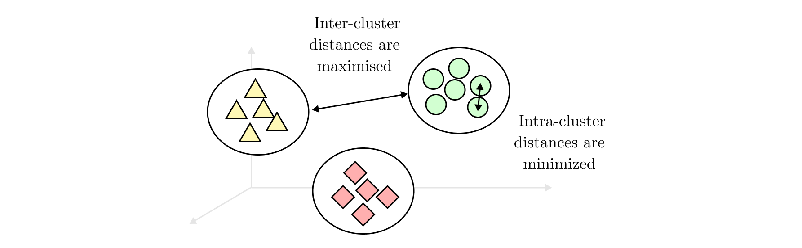

# Unsupervised learning

```{r}
library(ggplot2)
```

## Clustering
Clustering is the process of grouping instances based on similarity within some attributes of those instances. @Tan2011 defines the objective of a clustering process as follows

>The goal is that the objects within a group be similar (or related) to one another and different from (or unrelated to) the objects in other groups. The greater the similarity (or homogeneity) within a group and the greater the difference between groups, the better or more distinct the clustering

A more compact definition is provided by @Tan2019a7:

>The goal is to create groups (clusters) in which object shows remarkable similarities among them compared to objects of other clusters. 

Following this definition the the aim of clustering is to  minimize intra-cluster distance
and maximize inter-cluster distance (see figure). The similarity measure is usually defined with a mathematical formula (for example the euclidean distance), and the clustering algorithm aims to minimize this objective function. 

```{r clustering_goal, echo=FALSE, fig.align = 'center', fig.cap="Clustering goal", out.width = '100%'}

```

However, there is no right choice of the similarity metrics and the definition of clusters is intrinsically ambiguous and imprecise and that the best definition depends on the nature of data and the desired results.

### Clusters type

- _Well-separated clusters_ are a set of objects in which each object is closer
(or more similar) to every other object in the cluster than to any object not
in the cluster.

- _Prototype based clusters_ are a set of objects in which each object is closer
(more similar) to the prototype that defines the cluster than to the prototype
of any other cluster. Many times the prototype can be considered as the most central point of the distribution (e.g., in a continuous attributes could be the mean or median value), in this case we refer to this as _center based_ clusters

- _Graph based clusters_ are connected components (i.e., nodes) of a network structure. An example of graph based clusters are contiguity based clusters where two objects are connected only if they are within a specified distance of each other.

- _Density-based clusters_ are a dense region of objects that is surrounded by a region of low density.

- _Property or Conceptual clusters_  are a set of objects that share some property.


### Clustering algorithms 
can be categorized in different fashon:

- _Exclusive_ versus _non-exclusive_. 
- _Fuzzy_ versus _non-fuzzy_
- _Partial_ versus _Complete_. A complete clustering assigns every object to a cluster while a partial does not. Partial clustering can be applied when some objects in a data set may not belong to a well defined group and the analyst prefers to not assign the object to a cluster, for example when the object represents an oultier, noise or uninteresting for the analysis.
- _Heterogeneous_ versus _homogeneous_
- _Partitional_ vs _Hierarchical_. In the first case, the observations are divided into non-overlapping subsets called clusters. The hierarchical clustering generates non-overlapping clusters and each cluster can be further divided into sub-clusters and so on, creating a tree structure. 


In the following, the partitional K-means clustering and hierarchical clustering are presented. As an example the following dataset will be used for the implementation of clustering algorithms

```{r dataset_definition, out.width="50%"} 

df_cluster <- data.frame(
  point = paste0("p", c(1:6)),
  x = c(0.4005, 0.2148, 0.3457, 0.2652, 0.0789, 0.4548),
  y = c(0.5306, 0.3854, 0.3156, 0.1875, 0.4139, 0.3022)
)

df_cluster$labels <- paste0(df_cluster$point, " = [",df_cluster$x,",",df_cluster$y,"]")


ggplot(data = df_cluster,
  mapping = aes(x = x, y = y, label = point)) +
  geom_point(
    shape=21,
    colour = "black",
    fill = "#D2FFD1",
    size = 5,
    stroke = 1
  ) +
  geom_text(hjust = 0, nudge_x = 0.01) +
  theme_classic() # white bakground with lines

```


### K-means clustering
K-means is a partitional prototype-based clustering. It defines the prototype as the mean point of a set of objects. 

Given a dataset $D = \{x_1, \dots x_n\}$ of $n$ instances, the user sets the number of clusters $K$ in which the dataset has to be divided, and the initial centroid $c^{(0)} = \{c^{(0)}_1,  \dots c^{(0)}_K\}$ for each cluster $C = \{C_1, \dots C_K\}$. Then each element $x$ is assigned to the closest centroid $c_i$, and the points assigned to the same centroid forms a cluster $C_i$. The centroid of each cluster is then updated based on the points that belong to the cluster. This process continues iteratively until no points change cluster or the centroid remains the same with a certain error threshold $c^{(i-1)} \approx c^{(i)}$. In the following paragraphs each step is described in detail.

- Chose initial centroid
A careful choice of the initial centroids $c^{(0)}$ and number of clusters $K$ is the key to perform an effective clustering since the result is greatly depending on initial conditions. The centroids can be chosen by the user, can be picked randomly, chosen after multiple runs of the clustering algorithm or chosen after hierarchical clustering of a sample of point of the dataset.

- Create cluster
For each element $x$ the proximity measure to all the centroids $c_i$ is computed, the element is then assigned to the relative cluster $C_i$. The proximity measure quantifies the distance between an element and the centroid; different types of measures can be chosen regarding the type of elements to be analysed. The most widely used measure in K-means is Euclidean distance $L_2 = dist(x,c_i)$. 

- Update centroid
Once the proximity measure is defined the clustering algorithm has to recompute the centroid, maximizing the similarities between cluster elements by minimizing of a objective function. Given the Euclidean distance as proximity measure the \ac{SSE} can be used as objective function. It sums the error squared between an element and the closest centroid.
\begin{equation} \label{eq:SSE}
SSE = \sum^K_{i = 1} \sum_{x \in C_i} dist(x,c_i)^2
\end{equation}

Given two clusters, the best clustering is the one that has the smallest  \ac{SSE}  because it means that the points are closer to the centroid, and this better represents the cluster. It can be demonstrated that the centroid that minimises the  \ac{SSE}  is the mean.

In Figure \ref{fig:kmeans_example} a three steps K-means clustering is performed to a simple set of instances. At first glance in the data points is possible to distinguish three natural clusters so  $K=3$ is chosen. User-defined centroids $c^{(0)}$ are represented with stars. It is possible to see how the algorithm shifts the initial centroids toward the centre of the respective cluster in the successive iterations.
\begin{figure}[h]
\begin{center}
	\includegraphics[width=\textwidth]{Figures/kmeans_example}
	\caption[Example of K-means with $K = 3$.]{Example of K-means with $K = 3$. Adapted from \cite{Tan2019a7}.}
	\label{fig:kmeans_example}
\end{center}
\end{figure}


### Hierarchical clustering
As already said, hierarchical clustering consists of creating a series of nested clusters. There are two basic approaches to address to hierarchical clustering. The first is the _agglomerative clustering_ that consists of starting with single point clusters and then merge the closest pair of clusters. The second is _divisive clustering_ that consists of starting with one unique cluster and then split the clusters. This kind of clustering can be graphically viewed though a dendogram which shows the cluster relationships and the merging order. In the following, only the agglomerative clustering is reviewed since is the technique used in this framework.

```{r}
dist1 <- dist(df_cluster[2:3])  
```

The basic agglomerative algorithm approach consists in defining a proximity measure, compute a proximity matrix for all the instances, merge the closest clusters and update the proximity matrix until only one cluster remains. The key of this algorithm lies in the definition of proximity measure; there are three possibilities:

- _Single link or MIN_: the proximity is defined as the minimum distance between any of the two points of two different clusters;

- _Complete link or MAX_: the proximity is defined as the maximum distance between any of the two points of two different clusters;

- _Group average_: the proximity is defined as the average distance between all pairs of two different clusters


```{r}
hc_single <- hclust(dist1, method = "single")  

hc_complete <- hclust(dist1, method = "complete") 

hc_group <- hclust(dist1, method = "average") 

hc_ward <- hclust(dist1, method = "ward.D2")
```


A simple example of single link clustering is visible in Figure \ref{fig:single_link}. A set of six points in a 2D space are represented in the left side of the Figure. The single link agglomerative clustering defines as proximity measure the minimum distance between two points of two different clusters. The dendogram reported on the right shows that the first two points merged to create a cluster are p3-p6 and then p5-p2. The two resulting clusters are then merged, since the distance between p2 and p3 is less than the distance between any other point. Finally p4 is aggregated and followed by p1. 

```{r fig.show="hold", out.width="50%", echo = FALSE}
# Define nodePar
nodePar <- list(lab.cex = 1, pch = c(NA, 19), 
                cex = 1.5, col = "#D2FFD1")


# Customized plot; remove labels
par(mar = c(4, 4, .1, .1))
plot(as.dendrogram(hc_single), nodePar = nodePar )
plot(as.dendrogram(hc_complete), nodePar = nodePar)
```


## Association rule mining

The goal of association pattern mining is to determine associations between groups of items within a transactional dataset. The most used way to evaluate the degree of association consist in calculating the frequency of set of items. This method was originally born in the context of market basket data in supermarkets and the traditional terminology derives from it. However the application of this kind of analysis is wide and embraces many sectors.

### Frequent Pattern Mining 

The frequent pattern mining problem is defined on a transaction database $\mathcal{T}$ containing $n$ transactions. A single transaction $T_i$ is denoted by a transaction id $i$ and contains a set of $k$ items called itemset $I$. A $k-itemset$ is an itemset that contains exactly $k$ items. The group of all possible items is called universe of items $U$ and it is usually very large compares to a typical itemset.

An example of transaction database is reported in table. The database $\mathcal{T} = \{T_1,T_2,T_3,T_4,T_5\}$ contains $n=5$ transactions. The universe of items is $U = \{bread, butter, milk, eggs, yogurt, cheese\}$ and contains 6 items, meaning that the transaction binary representation will be represented by a 6-digit binary number. Transaction $T_1 = \{bread, milk, butter\}$ contains $k=3$ items and is a 3-itemset and is binary represented by the sequence $T_1 = \{110010\}$.

```{r, echo=FALSE}

library(arules)

df_transactional_example <- data.frame(
 id = as.factor(c(1:5)),
 Itemset = as.factor(c(
  "Bread, Butter, Milk",
  "Eggs,Milk,Yogurt",
  "Bread, Cheese, Eggs, Milk",
  "Eggs,Milk,Yogurt",
  "Cheese, Milk, Yogurt"
 )),
 Binary = as.factor(c("110010", "000111", "101110", "000111", "001011"))
)

kableExtra::kable(df_transactional_example)
```


Frequent pattern mining relies basically on the frequency count of items. In particular support count is defined as the number of occurrence of an itemset within a transaction database. For example the support count for the itemset $I = \{Eggs,Milk\}$ in table is equal to 2. 

However the support count is an absolute metrics that does not take into consideration the relative frequency of the itemset in the whole dataset. A more robust metric is the support, defined as the fraction of the transactions in the database $T = {T_1 \dots T_n }$ that contain $I$ as a subset. The support of an itemset is denoted as $sup(I)$. For example, the support of the itemset $I = \{Eggs,Milk\}$ in table is equal to $sup(I) = 2/5 = 40%$.

Itemset that are correlated will occur frequently together in transactions, this mean that they have a high support. Therefore the frequent itemset mining reduces to the task of finding all the set of items that have the requisite of minimum support, called $minsup$. The number of frequent itemsets is very sensible to the minimum support, which is crucial to obtain a meaningful size of frequent itemsets.


```{r}

# a_list <- list(
#       c("a","b","c"),
#       c("a","b"),
#       c("a","b","d"),
#       c("c","e"),
#       c("a","b","d","e")
#       )
# 
# ## set transaction names
# names(a_list) <- paste("Tr",c(1:5), sep = "")
# a_list
# 
# ## coerce into transactions
# trans1 <- as(a_list, "transactions")
# 
# ## analyze transactions
# summary(trans1)
# image(trans1)
# 
# 
# df_transactional <- data.frame(I = df_transactional_example$Itemset)
# trans = as(df_transactional, "transactions")
# 
# kableExtra::kable(inspect(trans))
# 
# support("{Milk}", trans)
# 
# frequentItems <- eclat (trans) # calculates support for frequent items
# inspect(frequentItems)

```


### Association rule generation

Frequent itemsets can be used to generate association rules, with the use of a measure known as the confidence. The confidence of a rule $X \rightarrow Y$ is the conditional probability that a transaction $T_i$ contains the set of items $Y$ (consequent), given that it contains the set $X$ (antecedent). This probability is estimated by dividing the support of itemset $X \cup Y$ with that of itemset $X$.
\begin{equation}
  conf(X \rightarrow Y) = \frac{sup(X \cup Y)}{sup(X)}
\end{equation}

For example, referring to table, by setting $X = \{Eggs,Milk\}$ and $Y = \{Eggs,Milk,Yogurt\}$, given that the support is respectively $sup(x) = 0.6$ and $sup(x) = 0.4$, the confidence of the rule $X \rightarrow Y$ is $0.4*0.6=2/3$. As in the case of support, a minimum confidence threshold $minconf$ can be used to generate the most relevant association rules.


### Frequent Itemset Mining Algorithms

#### Brute Force Algorithms

#### The Apriori Algorithm

#### Enumeration-Tree Algorithms

Some user-defined parameters (confidence support and lift) have to be set, in order to evaluate the significance of the obtained rule. A domain expert sets those parameters according to each particular case. 

The \emph{support} is calculated as the intersection between the antecedent $A$ and consequence $B$, expressing the co-occurrence of the two events:
\begin{equation}
\text{supp} (A \Rightarrow B) = P(A \cap B)
\end{equation}

The \emph{confidence} is defined as the conditional probability between $A$ and $B$, it gives the probability of the consequent event in all baskets containing the antecedent:
\begin{equation}
\text{conf}(A  \Rightarrow  B) = P(A|B)
\end{equation}

The \emph{lift} is the ratio between the confidence  and support and gives the correlation between the conditional probability of $B$ and the probability of $B$ without assumptions. 
\begin{equation}
\text{lift}(A  \Rightarrow  B) = \frac{P(A|B)}{P(B)}
\end{equation}

When $\text{lift} >1$ it means that is more probable that $B$ is correlated with $A$ while if $\text{lift} <1$ it means negative correlations, if  $\text{lift} =1$  there is no correlation at all. This parameter is particularly important since allows to select the most interesting rules \cite{Fan2015}.
