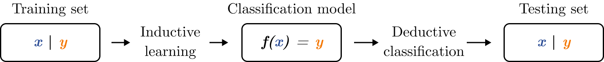

# Supervised learning

## Classification
Classification is the task to assign a class label to unlabeled data instances through a classifier model, providing prediction or description of a given data set.

A general data set consists of a collection of instances or observations $D = \{d_1, \dots, d_N\}$, each of them is characterised by a set of predictor attributes $x$ and a target attribute or class label $y$. The classification model creates a relationship between the set of attributes $x$ (input) and the class label $y$ (output), in other words, can classify instances through the analysis of the predictive attributes. The model is created through an inductive learning algorithm using a _training set_, which is a data frame with attributes and labelled instances. Once the model is created, it is used on a _test set_, which is a data frame with attributes and unlabelled instances, in order to deduce the unknown class labels. The performance of the model can be evaluated through the comparison between the predicted labels and the real labels of the test set. A general description of the classification process is reported in Figure \@ref(fig:classification_description). 

```{r classification_description, echo=FALSE, fig.align = 'center', fig.cap="Classification process.", out.width = '100%'}

```


### Decision trees
The tree classifier is the most commonly used classification model  thanks to its understandable graphical representation, an example is shown in  Figure \ref{fig:classification_tree_description}. Depending on the type of target attribute, discrete categorical or continuous numerical, the tree is called, respectively, \emph{classification tree} or \emph{regression tree}. The tree consists of three kinds of nodes connected by branches:

\begin{itemize}
\item \emph{Root node}: is the first node of the tree and is characterized by no incoming branches and only outgoing branches. It contains all the instances;
\item \emph{Internal node}: is characterized by one incoming branch and two outgoing branches. It contains a subset of the previous node;
\item \emph{Leaf node} (or \emph{terminal node}): is characterized by one incoming branch and no outgoing branches. It contains a subset of the previous node, and this subset is considered satisfactory for the classification. At each leaf node is assigned a class label.
\end{itemize}

\begin{figure}[h]
\begin{center}
	\includegraphics[width=11cm]{Figures/classification_tree_description}
	\caption{Classification tree description.}
	\label{fig:classification_tree_description}
\end{center}
\end{figure}

#### Hunt’s algorithm
#### Recursive partitioning
The basic algorithm used to construct a decision tree is a recursive partitioning forward approach \cite{Atkinson2000} which is used to create the so called \ac{CART}. 

In the beginning, all the instances are contained in the root node. Then it is expanded by a binary split on an attribute that is chosen through an adequate splitting criterion. This process continues until a stopping criterion is satisfied. In the following paragraphs each step is described in detail.

#### Splitting crieterion
It is the criteria to choose the attribute test condition for the binary splitting; it decides how the instances of the parent node should be distributed into the child nodes. This criterion tends to split instances in order to create purer child nodes in which most of the instances have the same class label. This criterion tends to maximise homogeneity at each split, yielding to locally optimum split.

The impurity $I(A)$ measures how different the class labels are within the same node \cite{Tan2019a}. It can be expressed as the sum on all the classes $c$ of a function of the relative frequency $p$ of instances belonging to a class $i$ contained in node $A$.
\begin{equation} \label{eq:impurity}
I(A) = \sum_{i=1}^c{f(p_{i,A})}
\end{equation}

The functions, or indeces, that can be used are various, the most used are the Gini index \eqref{eq:gini} and the entropy \eqref{eq:entropy}. Each of them is zero if the node is pure (contains only instances from one class $ p_{i,A}  = 1$) and maximum if labels are equally partitioned. 
\begin{gather}
f_{Gini}= 1 - \sum_{i=1}^c{ p_{i,A}}^2 \label{eq:gini} \\
f_{Entropy}=  - \sum_{i=1}^c{ p_{i,A} *\log_2(p_{i,A}) }  \label{eq:entropy}
\end{gather}

The variation of impurity $\Delta{I}$, also known as purity-gain,  between the parent and the child node is calculated to identify the best attribute condition for the split. The attribute that gives the higher impurity variation is selected.

#### Stopping criterion
 It is the criterion chosen to stop the growth of the tree. The basic algorithm stops the growth only when the generated node has instances of the same label or the same attributes. Sometimes it is better to terminate the growth to avoid data fragmentation: when a leaf node contains a few data, and they are not enough statistically significant. Another reason for which a stopping criterion should be set is to avoid model overfitting: when the model learns the particular patterns in the test set, reducing test error,  but fails to generalize or predict correctly, increasing test error. Stopping criteria are, for example, the minimum number of observation in each leaf node or the number of splits.

Next to the stopping criterion, a complexity parameter $c_p \in [0;1 ]$, which quantify the cost in complexity of the model when adding a new node, could be defined. By doing so, the full tree is constructed and then pruned: the higher the $c_p$ the smallest the tree ($c_p=1$ only root) while the lowest the $c_p$ the largest the tree ($c_p=0$ full tree). This parameter is calculated in the validation phase. 

#### Validation
This phase has the goal to test the generalization performance or the ability, of the prediction model, to perform on independent data.
The most used method is the re-sampling method called k-fold \ac{CV}; it permits to estimate the test error and to select the appropriate level of flexibility for the model.

It divides the dataset $D$ of size $N$ in $k$ folds of approximately equal size if $k=N$ this case is called \ac{LOOCV}. At each iteration, one of the folds $k$ is selected as the test set, while the others $k-1$ are used as train set. Once the model is trained and tested the test error is computed. This procedure is repeated for k times, and the overall error is computed as the mean of the single test errors. In this phase, is chosen the complexity parameter for which cross-validation error is minimized.

#### Globally optimum evolutionary tree
Another process that can be used to create a classification tree is the globally optimum evolutionary algorithm. The evolutionary tree algorithm is based on a stochastic algorithm that aims to construct a globally optimum classification model \cite{Grubinger2014}. This process randomly initializes the root node split, then at each iteration variation operators (i.e., split, prune, major split rule mutation, minor split rule mutation, crossover) are applied. The survivor is selected, and the process repeated until stopping criterion is satisfied. The advantage of this model is that it tends to offer higher accuracy in prediction than recursive partitioning algorithms while maintaining the same interpretable tree structure.

The main peculiarity of the globally optimum classification trees lies in its stochastic nature. At each iteration the algorithm applies to the model the following variation operators:
\begin{itemize}
\item \emph{Split} this operator randomly select a leaf node and assign it a random split rule that generated two child nodes;
\item \emph{Prune}  this operator randomly select an internal node and prunes it removing all its child nodes from the tree;
\item \emph{Major/minor split rule mutation} this operator randomly select an internal node and modifies the splitting rule;
\item \emph{Crossover} this operator randomly select two subtrees and exchange their position.
\end{itemize}

Those variation operators are randomly applied to the model following a probability distribution set by the user.


### Rule-based classification
### Associative classification
### Random Forest Classifier
### Neural Networks
### Bayesian Classification
### Support Vector Machines (SVM)
### Support Vector Machines
### K-Nearest Neighbor


